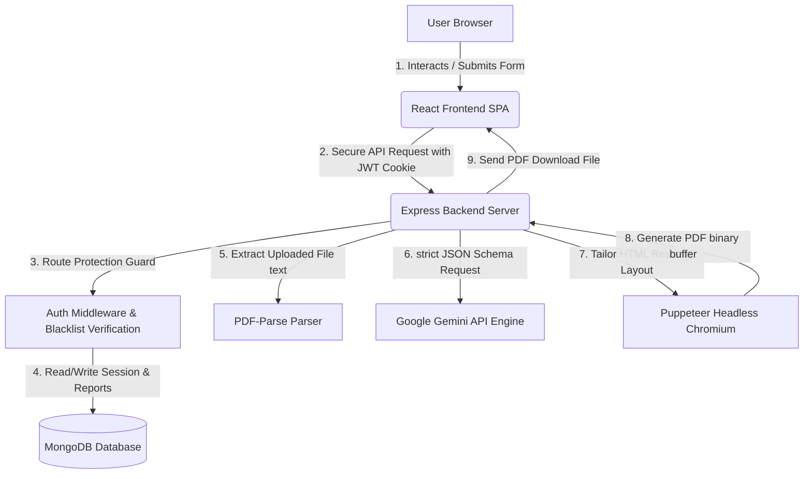
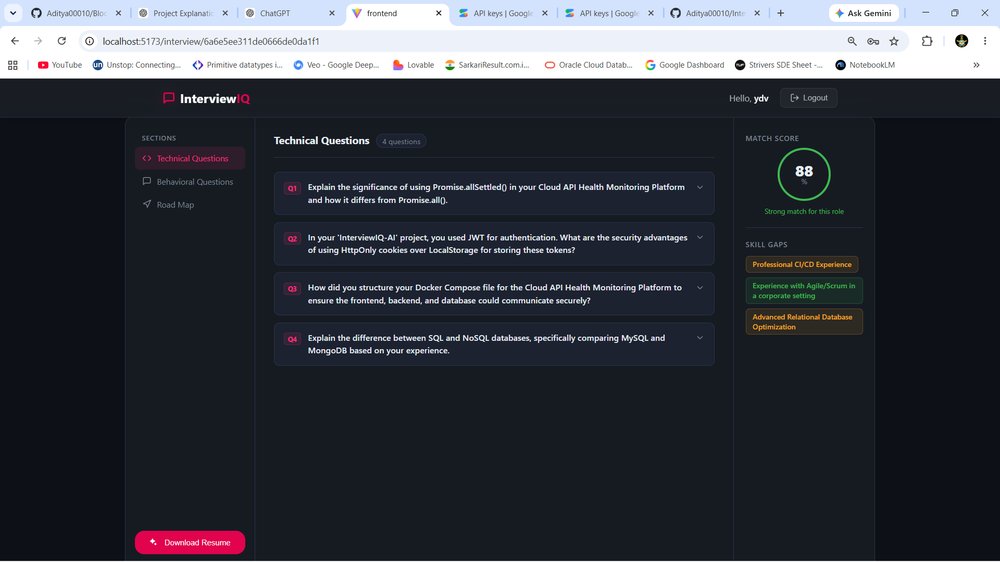
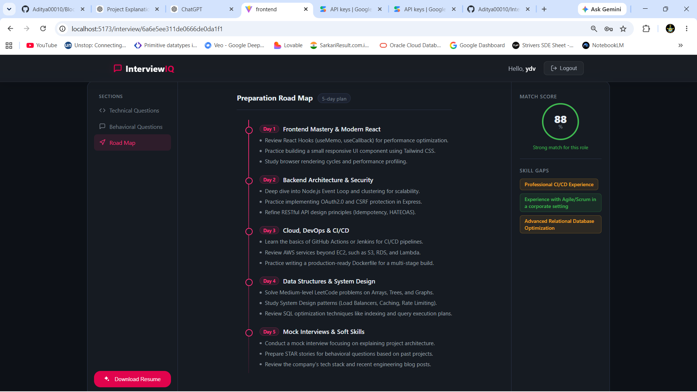
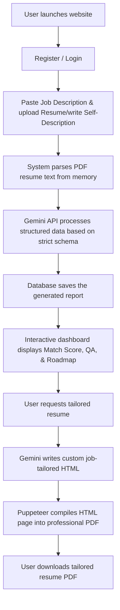
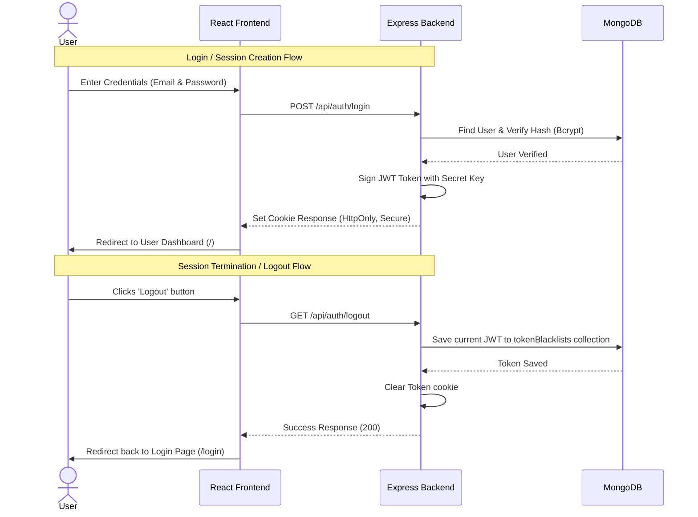
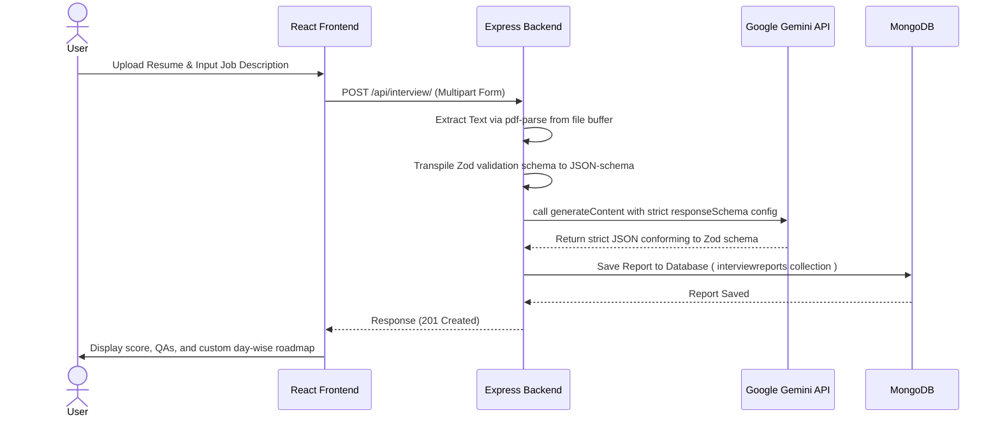

# 🚀 InterviewIQ-AI

> **An AI-powered Mock Interview Prep & Candidate Evaluation Platform** built using the MERN stack (MongoDB, Express, React, Node.js), powered by **Google Gemini 1.5/2.0 Pro/Flash APIs**, and utilizing **Puppeteer** for automated, high-fidelity resume generation.

---

<p align="center">
  
  
  
  
  
  
  
</p>

---

## 📌 Table of Contents

1. [Project Overview](#-project-overview)
2. [Project Metrics & Highlights](#-project-metrics--highlights)
3. [Architecture Diagram](#-architecture-diagram)
4. [Application Preview](#-application-preview)
5. [Key Features](#-key-features)
6. [Core Modules](#-core-modules)
7. [Tech Stack](#-tech-stack)
8. [System Architecture](#-system-architecture)
9. [Complete Workflow](#-complete-workflow)
10. [Folder Structure](#-folder-structure)
11. [Database Design](#-database-design)
12. [Authentication Flow](#-authentication-flow)
13. [AI Workflow & Structured Outputs](#-ai-workflow--structured-outputs)
14. [Tailored ATS Resume Generation](#-tailored-ats-resume-generation)
15. [API Documentation](#-api-documentation)
16. [Installation & Setup](#-installation--setup)
17. [Docker Deployment](#-docker-deployment)
18. [Environment Variables](#-environment-variables)
19. [Challenges Faced & Solutions](#-challenges-faced--solutions)
20. [Key Learnings](#-key-learnings)
21. [Resume Bullet Points](#-resume-bullet-points)
22. [Interview Pitch (5-Minute Speakable guide)](#-interview-pitch-5-minute-speakable-guide)
23. [License & Contact](#-license--contact)

---

## 🔍 Project Overview

### The Problem
Traditional job seekers struggle to align their resumes and preparation strategies with specific job descriptions. Many apply blindly without knowing how well their profile matches the requirements, what technical concepts to study, or how to formulate answers to behavioral questions. 

### The Solution
**InterviewIQ-AI** bridges this gap. It acts as an automated career coach that:
- Evaluates candidate profiles against target job descriptions.
- Highlights core **skills gaps** and assigns them impact severities.
- Generates tailored, structured technical and behavioral mock interview questions.
- Creates day-by-day structured study roadmaps.
- Uses AI to tailor their resume and compile it directly into an ATS-friendly, clean PDF using headless Chromium.

### Target Users
- **Job Seekers / Students** looking for a customized, data-driven interview preparation roadmap.
- **Bootcamp Graduates** wanting to practice role-specific behavioral/technical prompts.
- **Career Switchers** looking to quickly bridge skill gaps and tailor resumes for target roles.

---

## 📊 Project Metrics & Highlights

### Core Metrics
| Metric | Value |
| :--- | :--- |
| **Frontend** | React 19, Vite, Sass, Context API |
| **Backend** | Node.js, Express.js |
| **AI Model** | Google Gemini (1.5 Flash / 2.0 Flash) |
| **Database** | MongoDB + Mongoose ODM |
| **Authentication** | JWT (JsonWebTokens) + Secure Cookies |
| **PDF Engine** | Puppeteer (Headless Chromium) |
| **API Style** | REST API |
| **Architecture** | MERN + AI Structured Output Layer |

### Project Highlights
| Feature | Status |
| :--- | :---: |
| **Authentication & Protection** | ✅ |
| **PDF Resume Parsing** | ✅ |
| **Gemini AI Integration** | ✅ |
| **Strict Zod Structured Output** | ✅ |
| **ATS Resume Generator** | ✅ |
| **Puppeteer PDF Rendering** | ✅ |
| **MongoDB History & Session Store** | ✅ |
| **Docker Containerization** | ✅ |

---

## 🗺️ Architecture Diagram

This visual representation outlines how data flows securely from the user browser through the authentication middleware, is parsed, structured via Zod, analyzed by Gemini, saved in MongoDB, and compiled to PDF.



---

## 📷 Application Preview

### 1. Login Page
*Secure entry portal using HTTP-only cookie validation and real-time failure banners.*


### 2. Main Dashboard & Report Generator
*Dynamic dropzone with drag-and-drop file state trackers, dynamic character counter, and custom loaders.*


### 3. Study Roadmap & Interview Plan
*Match Score Ring, identified Skill Gaps, Technical/Behavioral Question accordion cards, and Day-wise roadmap.*


---

## 🌟 Key Features

- [x] **Secure Authentication & Token Blacklisting:** Cookie-based JWT authentication with server-side blacklist verification for robust logouts.
- [x] **Intelligent PDF Resume Parsing:** Reads PDF resume uploads directly into raw text arrays on-the-fly (memory buffer parsing).
- [x] **Structured AI Output Modeling:** Leverages `zod` and `zod-to-json-schema` to enforce strict schema adherence for Gemini responses, ensuring parsing stability.
- [x] **Interactive Dashboard:** View match scores, detailed technical/behavioral mock questions, key skill gaps, and day-wise plans in a modern, dynamic glassmorphic card layout.
- [x] **Tailored ATS Resume & HTML-to-PDF compiler:** Prompts AI to write custom tailormade HTML stylesheets and renders them into professional PDF downloads using Puppeteer.
- [x] **Smart Fallbacks:** Generate interview strategies using *only* self-description parameters if no resume file is handy.
- [x] **Dynamic UX Touchpoints:** Drag-and-drop file upload zones with border hover animations, real-time character counters, and smooth loading spinners.

---

## 🧩 Core Modules

```text
┌─────────────────────────┐      ┌─────────────────────────┐      ┌─────────────────────────┐
│  Authentication Module  ├─────►│Interview Analysis Module├─────►│    Dashboard Module     │
│(Register, Login, Cookies)│      │(Multer, PDF-Parse, GenAI)│      │ (Score, QA Accordions)  │
└─────────────────────────┘      └────────────┬────────────┘      └─────────────────────────┘
                                              │
                                              ▼
┌─────────────────────────┐      ┌─────────────────────────┐
│     History Module      │◄─────┤Resume Generator Module  │
│ (Past Plan Collections)  │      │  (Gemini + Puppeteer)   │
└─────────────────────────┘      └─────────────────────────┘
```

1. **Authentication Module:** Manages session cookies, bcrypt password hashing, token generation, and secure routes verification.
2. **Interview Analysis Module:** Uploads file streams into memory, extracts raw text content, combines inputs with target job configurations, and streams prompts into the Google GenAI compiler.
3. **Dashboard Module:** Renders the customized report, displaying match score meters, question accordions, and day-wise roadmap grids.
4. **Resume Generator Module:** Leverages Gemini to craft resume markup tailored to the target job description and runs headless Chromium (Puppeteer) to render high-fidelity, ATS-friendly PDF downloads.
5. **History Module:** Pulls past report profiles directly from MongoDB, allowing users to track and load their progress histories.

---

## 💻 Tech Stack

| Category | Technologies |
| :--- | :--- |
| **Frontend** | React 19, React Router v7, Sass (SCSS), Context API, Axios |
| **Backend** | Node.js, Express.js |
| **AI Integration** | Google GenAI SDK (`@google/genai`) |
| **Database** | MongoDB, Mongoose ODM |
| **Authentication** | JWT (JsonWebTokens), Cookie-Parser, BcryptJS |
| **PDF Extraction** | Multer (Memory Storage), PDF-Parse |
| **PDF Compiler** | Puppeteer (Headless Chromium) |
| **Validation** | Zod, Zod-to-JSON-Schema |
| **Containerization** | Docker, Docker Compose, Nginx |

---

## System Architecture

<details>
<summary>🔍 View ASCII Architecture Diagram</summary>

```text
       ┌────────────────────────┐
       │   React SPA (Client)   │
       └───────────┬────────────┘
                   │ HTTPS Request (JWT Cookie)
                   ▼
       ┌────────────────────────┐
       │  Express App (Server)  │
       └───────────┬────────────┘
                   ├───────────────────────────────┐
                   ▼                               ▼
       ┌──────────────────────┐          ┌───────────────────┐
       │   MongoDB Database   │          │   Puppeteer PDF   │
       │(Users, Plans, Tokens)│          │  (Headless Chrome)│
       └──────────────────────┘          └───────────────────┘
                   │
                   ▼
       ┌──────────────────────┐
       │  Google Gemini API   │
       │  (Structured JSON)   │
       └──────────────────────┘
```
</details>

---

## 🔄 Complete Workflow



1. **User Auth:** User registers/logs in. JWT token is stored inside a secure cookie.
2. **Setup Prompt:** User pastes a target job description and uploads their resume (PDF) or inputs their professional details.
3. **Parse & Request:** The backend extracts resume text from the PDF using `pdf-parse`. The text is combined with the job description into a prompt structured around a strict Zod JSON schema.
4. **Structured Generation:** Gemini parses the inputs, scores the candidate's match percentage, identifies skill gaps, compiles technical/behavioral interview questions, and creates a study plan.
5. **Storage:** The structured object is returned, parsed, stored in MongoDB, and displayed on the dashboard.
6. **Resume Tailoring:** The user requests a tailored resume. Gemini outputs job-specific styled HTML, which Puppeteer processes into a downloadable PDF document.

---

## 📂 Folder Structure

```text
InterviewIQ-AI/
├── Backend/                     # Node.js backend
│   ├── src/
│   │   ├── config/              # Database connection setup
│   │   ├── controllers/         # Logic for auth and interview reports
│   │   ├── middlewares/         # JWT verification, upload limits, file parsing
│   │   ├── models/              # User, InterviewReport, and Token Blacklist schemas
│   │   ├── routes/              # Express endpoint paths
│   │   └── services/            # Gemini API and Puppeteer PDF compilers
│   ├── server.js                # App server listener & dotenv injection
│   └── package.json
│
├── Frontend/                    # React Vite frontend
│   ├── src/
│   │   ├── features/
│   │   │   ├── auth/            # Auth pages, hooks, contexts, & Header
│   │   │   └── interview/       # Dashboard pages, hooks, API contexts, styles
│   │   ├── style/               # Core button & SCSS layouts
│   │   ├── App.jsx              # Main context provider wrapper
│   │   └── main.jsx             # React DOM entry point
│   ├── vite.config.js
│   └── package.json
│
└── Screenshots/                 # Application screenshots
```

---

## 🗄️ Database Design

### User Model (`users`)
Stores core user details and credentials.
- `username` (String, Required, Unique): Account username.
- `email` (String, Required, Unique): Account email address.
- `password` (String, Required): Hashed password.

### Blacklist Model (`tokenBlacklist`)
Stores logged-out tokens to prevent token reuse.
- `token` (String, Required): Blacklisted JWT.
- `createdAt` (Date): Auto-purges tokens after expiry using MongoDB TTL indexes.

### Interview Report Model (`interviewreports`)
Stores detailed analysis records generated by Gemini.
- `user` (ObjectId): References `users.id`.
- `jobDescription` (String, Required): Text description of the target job.
- `resume` (String): Extracted text from candidate's resume.
- `selfDescription` (String): Manual professional overview.
- `matchScore` (Number): Match percentage (0-100).
- `title` (String, Required): Generated target job title.
- `technicalQuestions` (Array of Subdocuments):
  - `question` (String), `intention` (String), `answer` (String).
- `behavioralQuestions` (Array of Subdocuments):
  - `question` (String), `intention` (String), `answer` (String).
- `skillGaps` (Array of Subdocuments):
  - `skill` (String), `severity` ("low", "medium", "high").
- `preparationPlan` (Array of Subdocuments):
  - `day` (Number), `focus` (String), `tasks` (Array of Strings).

---

## 🔒 Authentication Flow

Here is the step-by-step sequence detailing how registration, login sessions, cookie transfers, and secure blacklisted logouts take place:



---

## 🤖 AI Workflow & Structured Outputs

A standard challenge with LLM endpoints is response consistency. To solve this, **InterviewIQ-AI** enforces strict structured output formats using Google Gemini schemas:

```javascript
// 1. Define strict Zod Schema
const interviewReportSchema = z.object({
    matchScore: z.number().describe("Score between 0 and 100..."),
    technicalQuestions: z.array(z.object({
        question: z.string().describe("The question text..."),
        intention: z.string().describe("Why the interviewer is asking this..."),
        answer: z.string().describe("Detailed ideal answer guide...")
    })),
    // ... other fields
});

// 2. Transpile to standard JSON schema and feed into Gemini Config
const response = await ai.models.generateContent({
    model: "gemini-3-flash-preview",
    contents: prompt,
    config: {
        responseMimeType: "application/json",
        responseSchema: zodToJsonSchema(interviewReportSchema),
    }
});

// 3. Directly parse response without formatting worries
const parsedData = JSON.parse(response.text);
```

### Complete AI Generation Sequence:



---

## 📄 Tailored ATS Resume Generation

1. **HTML Structuring:** The user clicks "Download Resume" in the dashboard. The backend passes the job description, resume text, and self-description to Gemini.
2. **Template Output:** The AI outputs standard HTML structure customized to the target job description (optimized with colors, clear headers, and layouts).
3. **Chromium Rendering:** Puppeteer launches a headless browser, sets the styled HTML page content, and compiles it into an A4 PDF document:
   ```javascript
   const browser = await puppeteer.launch();
   const page = await browser.newPage();
   await page.setContent(htmlContent, { waitUntil: "networkidle0" });
   const pdfBuffer = await page.pdf({ format: "A4", margin: { top: "20mm", bottom: "20mm" } });
   await browser.close();
   ```
4. **Download:** The backend sends the buffer back to the frontend with `Content-Type: application/pdf` headers, downloading the PDF directly on the client.

---

## 📋 API Documentation

### Auth Endpoints

| Method | Endpoint | Description | Auth Required |
| :--- | :--- | :--- | :---: |
| `POST` | `/api/auth/register` | Registers a new user. Stores token in HTTP-only cookie. | No |
| `POST` | `/api/auth/login` | Logins user with email/password. Stores token in cookie. | No |
| `GET` | `/api/auth/logout` | Clears cookie and blacklists JWT token. | Yes |
| `GET` | `/api/auth/get-me` | Returns current user profile details. | Yes |

### Interview Plan Endpoints

| Method | Endpoint | Description | Auth Required |
| :--- | :--- | :--- | :---: |
| `POST` | `/api/interview/` | Generates a report from raw PDF resume and/or self-description. | Yes |
| `GET` | `/api/interview/` | Retrieves brief overview of past reports (for home history). | Yes |
| `GET` | `/api/interview/report/:interviewId` | Fetches a detailed interview report document. | Yes |
| `POST` | `/api/interview/resume/pdf/:interviewReportId` | Generates a job-tailored resume PDF via Gemini and Puppeteer. | Yes |

---

## 🚀 Installation & Setup

### 1. Clone the repository
```bash
git clone https://github.com/your-username/InterviewIQ-AI.git
cd InterviewIQ-AI
```

### 2. Configure Environment Variables
Create a `.env` file in the `/Backend` directory:
```env
PORT=3000
MONGO_URI=mongodb://localhost:27017/interviewiq
JWT_SECRET=your_jwt_secret_key_here
GOOGLE_GENAI_API_KEY=your_gemini_api_key_here
```

### 3. Install and run Backend
```bash
cd Backend
npm install
npm run dev
```

### 4. Install and run Frontend
Open a new terminal window:
```bash
cd Frontend
npm install
npm run dev
```
Open [http://localhost:5173](http://localhost:5173) in your browser.

---

## 🐳 Docker Deployment

The application is fully containerized and production-ready using **Docker** and **Docker Compose**:
- **Multi-Stage Frontend Build**: Runs a React compilation phase using Node, and then hosts the optimized static assets via `nginx:alpine` with Gzip compression enabled.
- **Nginx Reverse Proxy**: Single ingress point on port `80` that reverse-proxies `/api` requests internally to the Node backend.
- **Private Backend**: The Node backend container is fully isolated and does not publish port 3000 to the host, protecting it from public internet exposure.
- **Chrome Sandbox & Puppeteer Execution**: Backend Dockerfile includes native Debian slim system packages to securely run headless Chromium as a non-root `node` user.
- **Startup Sequencing**: Utilizes Docker health checks to guarantee the frontend container only spins up after the backend database connections report healthy.

For full setup and usage commands, see the detailed [Docker Deployment Guide (README-Docker.md)](README-Docker.md).

---

## 🛠️ Environment Variables

- `PORT`: Port the Express server runs on.
- `MONGO_URI`: MongoDB connection string.
- `JWT_SECRET`: Secret key used to sign JSON Web Tokens.
- `GOOGLE_GENAI_API_KEY`: API key for Google Gemini GenAI services.

---

## 💡 Challenges Faced & Solutions

### 1. File Upload State Loss During React Re-renders
- **Challenge:** Changing the `resumeFile` state triggered a component re-render. Because the conditional structure swapped the dropzone label for a file info block, React reconstructed the adjacent `<input>` tag, clearing the file reference from the DOM before processing completed.
- **Solution:** Added a stable `key="resume-file-input"` to the file `<input>` element. React now tracks the element across state updates and preserves the DOM node.

### 2. PDF Parsing Reliability
- **Challenge:** PDFs uploaded from different formats (ATS, standard Word exports) had varying page layouts, sometimes causing parsing libraries to choke or output unformatted strings.
- **Solution:** Switched to a robust Uint8Array memory-buffer parser parsing raw text structures safely, while adding server-side guards to verify inputs and process empty values if a user prefers to write a self-description.

### 3. Headless Browser PDF Generation Overheads
- **Challenge:** Launching Puppeteer browsers in Node can consume significant server memory and causes timeouts if left hanging.
- **Solution:** Implemented clean browser initialization controls, utilizing strict `waitUntil: "networkidle0"` limits to guarantee CSS sheets load, and wrapped operations in `try-finally` blocks to ensure `browser.close()` runs even if rendering fails.

---

## 🎓 Key Learnings

- **Strict Structured Outputs:** Gained experience mapping Zod schemas directly into Gemini config calls to enforce reliable, format-safe JSON responses.
- **State Preservation in React:** Learned how React reconciles child nodes and how to use stable keys to preserve DOM state during conditional layouts.
- **Stateless Authorization Patterns:** Implemented cookie-based JWT tokens combined with database token blacklisting to secure routes while maintaining state.
- **PDF Extraction and Compilation:** Built parsing pipelines using Multer memory buffers and Puppeteer Chromium PDF rendering.


## 📄 License & Contact

Distributed under the MIT License. See [LICENSE](LICENSE) for more details.

**Aditya** - [GitHub Profile](https://github.com/Aditya00010) - Aditya00010@gmail.com 
